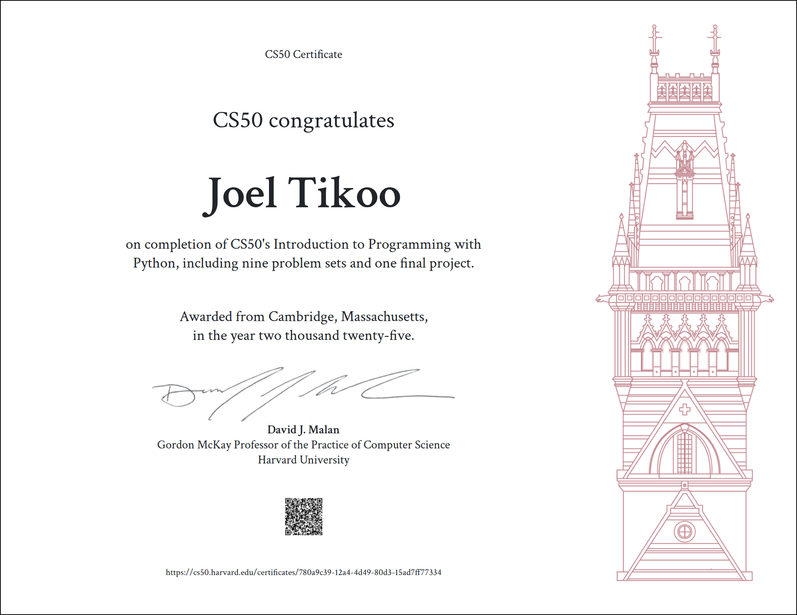

# News Oversimplifier CLI Tool

A simple Python command-line tool that fetches recent news articles based on a search query using [NewsAPI](https://newsapi.org/) and summarizes the article content using extractive summarization. You can also save the summaries to a text file.


---

#### CS50P

Built for my CS50P final project.




---

## Features

* Fetch latest news articles using a keyword
* Automatically generate summaries using the `summa` NLP library
* Display capitalized article titles
* Show summary word count
* Option to save results in a text file
* Built-in unit tests using `pytest`

---

## Requirements

Install the dependencies from `requirements.txt`:

```bash
pip install -r requirements.txt
```

Contents of `requirements.txt`:

```txt
requests
python-dotenv
summa
pytest
```

---

## How to Use

### 1. Get an API Key

Sign up at [https://newsapi.org/](https://newsapi.org/) to get your free API key.

### 2. Set Up `.env` File

Create a `.env` file in the root directory:

```
NEWS_API_KEY=your_api_key_here
```

### 3. Run the Script

```bash
python project.py <search_query>
```

Example:

```bash
python project.py technology
```

For multi-word search queries, enclose them in single quotes (`'<search_query>'`) or double quotes (`"<search_query>"`)

Example:

```bash
python project.py "artificial intelligence"
```

You'll be prompted to enter the number of articles you want to fetch and whether you want to save the results.

---

## Running Tests

To run tests for the summarization, word count, and capitalization logic:

```bash
pytest test_project.py
```

---

## Custom Functions Explained

### `fetch_news(api_key, query, max_articles=5)`

* Uses the NewsAPI to fetch articles related to the search query.

### `summarize_text(text, ratio=0.6)`

* Summarizes the article content using the `summa` library. Filters unwanted outputs (like the default error).

### `word_count(text)`

* Counts and returns the number of words in the summary.

### `capitalize_title(title)`

* Converts article titles to uppercase.

### `save_summary(title, summary, path="summaries.txt")`

* Saves the article title and summary to a `.txt` file with formatting.

---

## File Structure

```
project.py            # Main script
test_project.py       # Unit tests for helper functions
.env                  # Stores your API key (not checked into version control)
requirements.txt      # Dependencies
summaries.txt         # Optional output file where summaries are saved
```

---

## Example Output

```text
1. AI IS CHANGING THE WORLD

OVERSIMPLIFIED:
Artificial Intelligence continues to revolutionize global industries...
45 words

Would you like to save this in a text file? (y/n): y
```

---

## Future To-do

1. Add a text-to-speech (tts) feature
2. Save summaries in a custom filename and type as per user's choice
3. Support for multiple languages instead of just English
4. Shifting from CLI to web-based interface using `Flask` or an app-like GUI using `tkinter`

Feel free to recommend more features or optimizations or better tests!

## License

MIT License. Feel free to fork, modify, and use it in your own projects.

---
